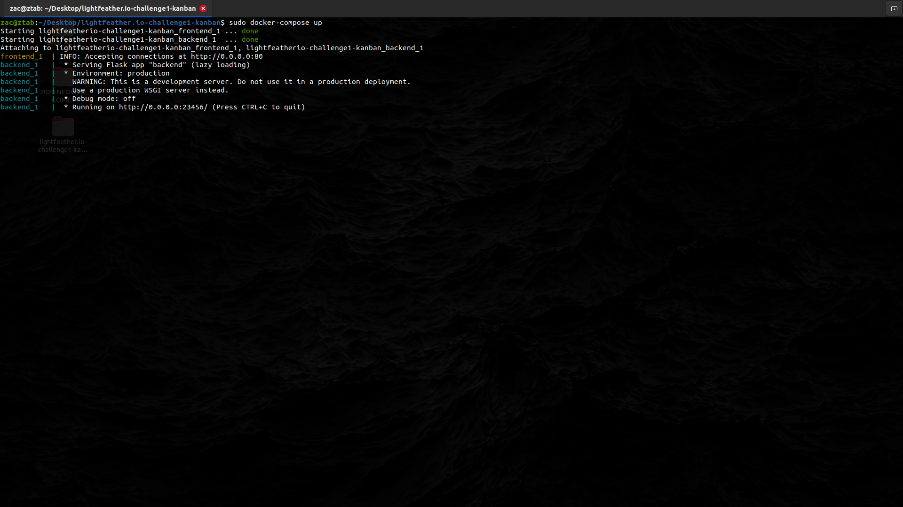
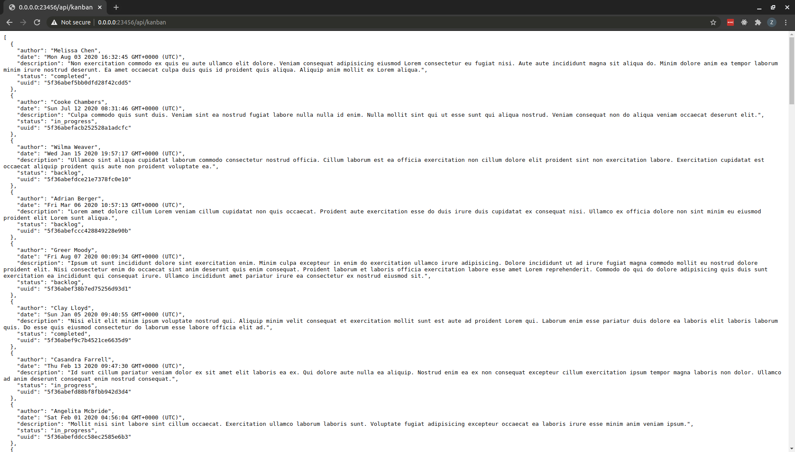
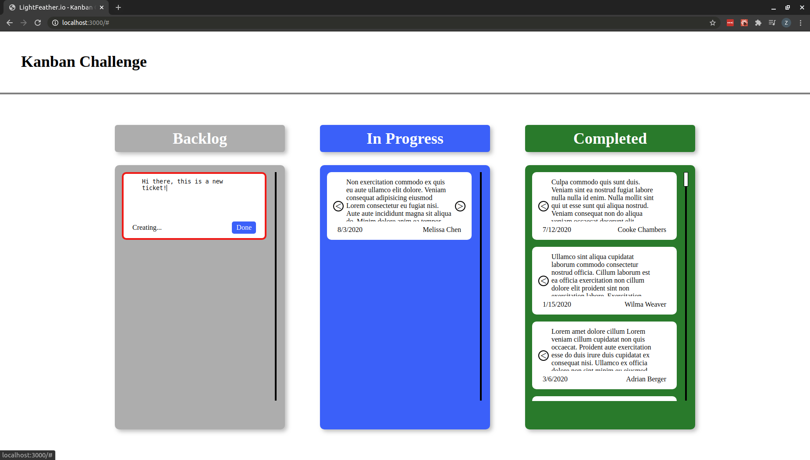

# LightFeather.io - Full Stack Kanban Challenge

## Specifications

* [Fullstack Engineer Challenge (pdf)](documentation/specification/Fullstack%20Engineer%20Challenge%202.0.pdf)
* Readme, Docker, Backend, Frontend

#
##### Assumptions to clarify
1. server specification for simple memory store, no db, **assuming no WSGI/NGINX/multi-process for API**
2. server specification describes updating the state, but not the encoded file, **verify this conclusion?**
3. server specifications describe a maximum, not a minimum value, **assuming minimum is ascii 0**
8. server specifications put the api on **port 23456, which I believe requires CORS, verify, but implementing for now**, do they just mean backend?
4. putting everything in one repo, but typically I like to manage backend, frontend, documentation in separate repos.
5. figma mock looks well proportioned / centered, **does the client want it single column or full page?**
6. there's an unspecified border radius on the task cards in the mock up, **assuming something that looks similar**
7. the specified lane width of 388px doesn't allow for common half screen **following spec**
8. header 4px bottom border looks like it might be a margin?
#
#

## Design

##### Initial Thoughts

* Python Backend (~~nginx WSGI load balancing~~ (would require db/memstore)
* React Frontend
* Nginx load balance / reverse proxy?

##### Security
1. CORS should probably be refined to allowed host headers
2. API would eventually implement user input verification and rate limiting

# Running
```shell script
docker-compose up
```

# Screenshots

Docker Compose Up



Backend Get Request



Frontend


